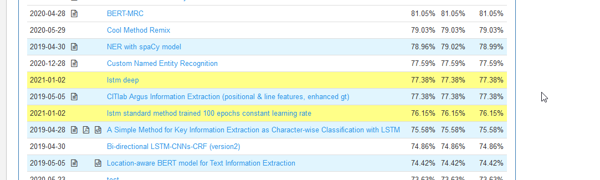

# Qubitrics_NER

# Leaderboard Score

## 1. Task 3 - Key Information Extraction from Scanned Receipts

**Task Description from the ICDAR website.**

This task aims to extract texts of several key fields from given receipts and save the texts for each receipt image in a JSON file with the format shown in Figure 3. Participants will be asked to submit a zip file containing results for all test invoice images. 

## 2. Folder Details

  1. `Best Model/`  : This folder contains the final best performing model.
  2. `Data_Dicts/` : This folder contains data dicts (produced in the `Data Preparation Notebook`). This contains the training and testing data. 
  3. `Resulst/` : This folder contains the .zip submission files of the best models. 
  
  
## 3. Notebooks

There are two notebooks in this repo. 

  1. `Data Preparation Notebook` : This notebook deals with data cleaning, removing duplicates, preparing training and testing data. The output of the notebooks is stored as pickle files stored in the Data_Dicts/ folder. [colab links](https://colab.research.google.com/drive/1-xvLu_5MtFwfsmK_iWc1Yci8w2Kv9EzH?usp=sharing)
  
  2. `Modelling` Notebook : This notebook deals model creation, experimenting with Lstm and Bert models, producing the .zip files.
  [colab links](https://colab.research.google.com/drive/1p4jm0FylSIBo71nzNDpUeMCJFxRsUCEH?usp=sharing).
  

## 4. Models

There are two architectures LSTMS and Bert Models used.

1. LSTM 
    1. A small model with 2 lstm layer and final output layer: 76 % on the leaderboard. 
    2. A deep model with 3 lstm layers + dropout and 2 hidden layers: 77.5 % on the leaderboard
 
2.  Bert Model
    1. Model 1 :  Using the pretrained bert model as an embedding with a  lstm layer. 
    2. Model 2 : Training the bert model with the lstm + hidden layer. 
    
  
## 5. Model Selection Criterion
   There are three things considered while selecting the final model. 
   
   1. Training Time: The model which can train quickly and get desirable results is better than using a high-end approach which takes too long to train. Because while in production the models will have to be re - trained.

   2. Model Size : This Parameter considers the model's size (disk space occupied) by the model. A model with lower storage is considered as this also reduces the cost of the model when deployed in cloud.
  
   3. Compute Resources: This parameter refers to the CPU/GPU and Ram required to train the model.

## 6. Compare the models.
  
  
  <table>
  <tr>
  <th> Models </th>
  <th> Training Time </th>
  <th>Model Size</th>
  <th>Compute Resources</th>
  <th>Accuracy % </th>  
  </tr>
  <tr>
    <td> LSTM Small </td>
    <td> abt 25 min </td>
    <td> 8 mb </td>
    <td> Easily trained on Colab GPU T4 </td>
    <td> 76% </td>
  </tr>  
  <tr>
    <td> LSTM Big (deep) </td>
    <td> abt 45 min </td>
    <td> 24 mb </td>
    <td>Easily trained on Colab GPU T4</td>
    <td> 77% </td>
  </tr>  
   <tr>
    <td> Bert Model </td>
    <td> more than 1hr </td>
    <td> 400 mb </td>
    <td>Max Batch Size = 8</td>
    <td> max 69% </td> 
  </tr>  
 </table>

**Model Selection:**
Final model selection : Small Lstm since the accuracy difference is only 1%  between the Deep or Big Lstm but the size (storage) difference is abt 3x and training time is also doubled. This will be a good model to deploy. 

Sadly, The bert model is out of the question as the accuracy is low, size is very huge, and difficult to train on free and get desirable results on colab gpus.

## 7. Final Conclusions.
1. A large amount of work goes into dataset creation, cleaning, and making sure no. errors are there in the prepared dataset.  
2. Using Character level classification I thing has worked better then token level.
  

